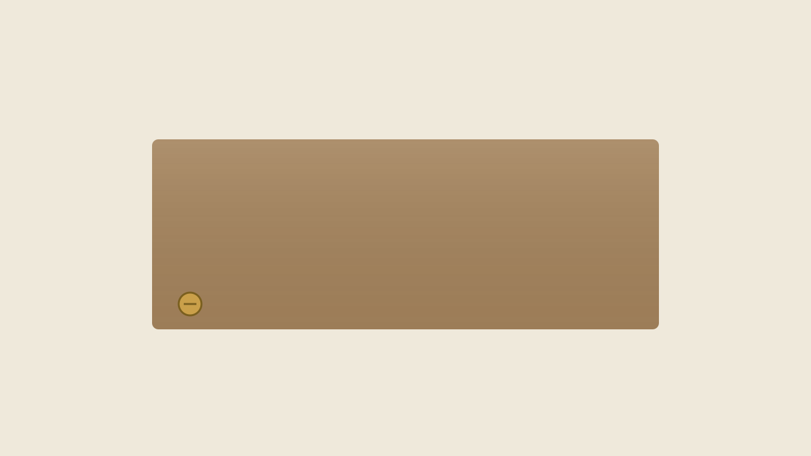

#+TITLE: The Corner Birdhouse
#+DATE: 2026-07-28
#+DRAFT: false
#+MAKERS[]: Rosa_Delgado
#+TAGS[]: woodworking outdoors
#+DESCRIPTION: Rosa turned a fallen maple branch and a jar of leftover paint into a birdhouse the whole block now watches.
#+COVER: cover.svg
#+COVERALT: A small peaked-roof birdhouse painted teal, mounted on a weathered fence post.
#+COVERCAPTION: The birdhouse on Rosa's fence, three days after the first tenant moved in.

Rosa lives at the corner where the street bends toward the park. This spring a
storm took down half of her old maple, and instead of hauling the wood to the
curb she kept the straightest branch and let it dry in her garage.

* What she made

A birdhouse, but a particular one: peaked roof, a single 32&nbsp;mm entrance hole
(sized, she told me, for chickadees and nobody bigger), and a floor that slides
out so it can be cleaned at the end of the season.

#+CAPTION: The sliding floor, held by a single brass screw.
#+ATTR_HTML: :alt A close view of a wooden birdhouse base with a brass screw at one corner.

* How it went together

- The body is a single length of maple, resawn into four walls.
- The roof is cedar left over from a neighbor's fence project.
- The paint is the teal she used on her front door in 2019.

#+BEGIN_QUOTE
"I didn't buy a thing for it. That was the whole point." — Rosa
#+END_QUOTE

* Watch the tenants

A short clip from the morning the first chickadee arrived:

#+BEGIN_EXPORT html
<figure>
  <video controls preload="none" width="720" poster="cover.svg">
    <source src="clip.mp4" type="video/mp4">
    
Your browser can't play this video.
       <a href="clip.mp4">Download the clip</a> instead.

  </video>
  <figcaption>Twelve seconds of a chickadee deciding whether to commit.</figcaption>
</figure>
#+END_EXPORT

If you walk past the corner in the early morning, slow down. There is usually
something happening at the little teal house.
